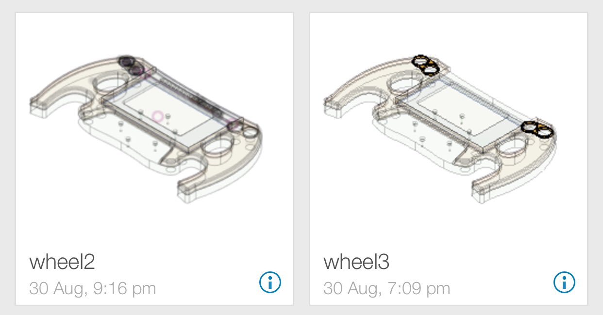
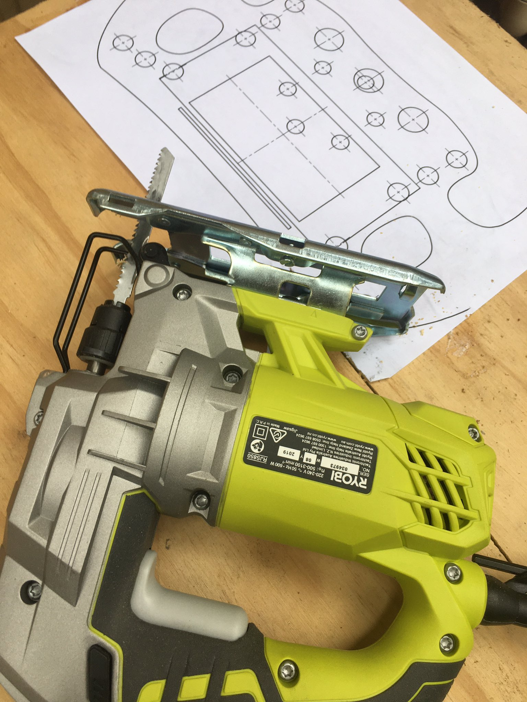
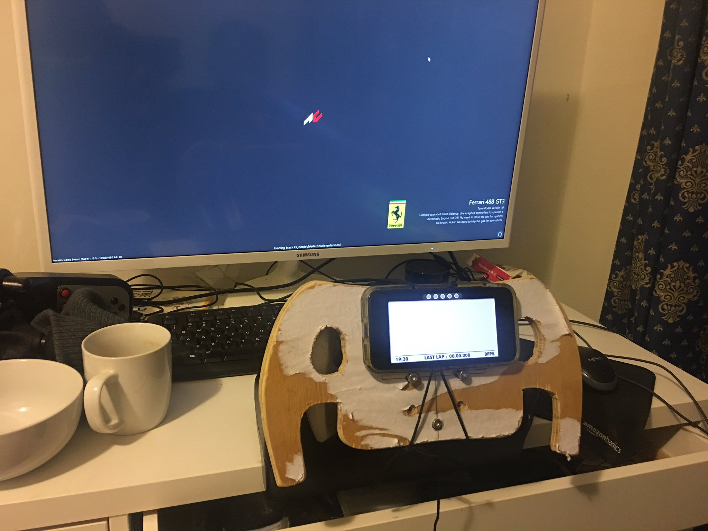
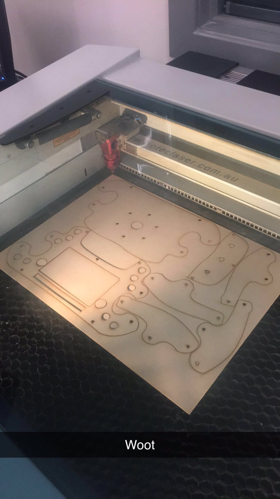
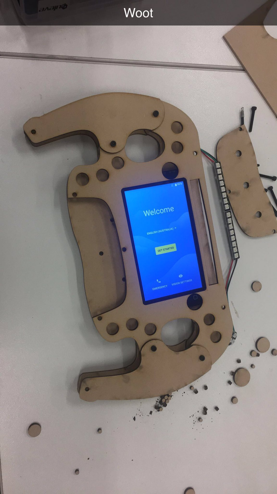

> I started making a formula 1 style steering wheel for my G27 couple of weeks ago. It has been progressing slowly whenever I get some free time. Came across some cool software along the way and wanted to share.  Watch this space.  #F1WheelProject
[via twitter](https://twitter.com/thilinag/status/1170641739335364608)
    
> First task was to design the rough idea on a cad software. Autodesk fusion 360 has a free hobbyist license and excellent for the task.
[via twitter](https://twitter.com/thilinag/status/1170643789708283905)

> Started adding more detail to the design based on Mercedes F1 wheel and laser cut the design in a 3mm MDF for test fit", [via twitter](https://twitter.com/thilinag/status/1170645025895546883)

> From fusion 360 you can export sketches as DXF vector format. Used awesome http://deepnest.io to find the optimal nesting to save material and save time when laser cutting #F1WheelProject [via twitter](https://twitter.com/thilinag/status/1170646466378944512)

> As the screen of the wheel I’m using a cheap android phone. The telemetry data from racing games is provided by simhub. https://github.com/SHWotever/SimHub. If you are doing any sim racing related project this is the best thing ever. #F1WheelProject" [via twitter](https://twitter.com/thilinag/status/1170648000508485632)

> For the rpm and flag status during race I’m using a arduino ATmega328  nano board. Again the data is provided by simhub.[via twitter](https://twitter.com/thilinag/status/1170649813777448960)

> Next up is buttons. It will have 10 momentary push buttons. 3 rotary buttons (rotary come with a push function) and 2 micro leaver switches for shifters. Need to figure out a way to do a button matrix. Building on ATmega32u4 arduino pro micro using https://github.com/MHeironimus/ArduinoJoystickLibrary" [via twitter](https://twitter.com/thilinag/status/1170663539553357824)

> Laser cutting was done at @MakerspaceAdl awesome place with awesome community if you need any laser cutting or 3D printing done. [via twitter](https://twitter.com/thilinag/status/1170668327997280257)

> NeoPixel LEDs are super fun [via twitter](https://twitter.com/thilinag/status/1170894472416129024)

> Printing one of the parts for the F1 wheel on the awesome @Zortrax_3D  M300 at @MakerspaceAdl today #F1WheelProject
[via twitter](https://twitter.com/thilinag/status/1172770792871849989)

> Project update on f1 steering build. Buttons and lights done. Working on quick release mechanism to connect it to the steering base 🏎
[via twitter](https://twitter.com/thilinag/status/1188396024470966272)

> MFD menu with rotary encoders
[via twitter](https://twitter.com/thilinag/status/1188396090741030912)

> Using neopixels for RPM lights, deltas, sector times, flags etc
[via twitter](https://twitter.com/thilinag/status/1188396151902363649)
