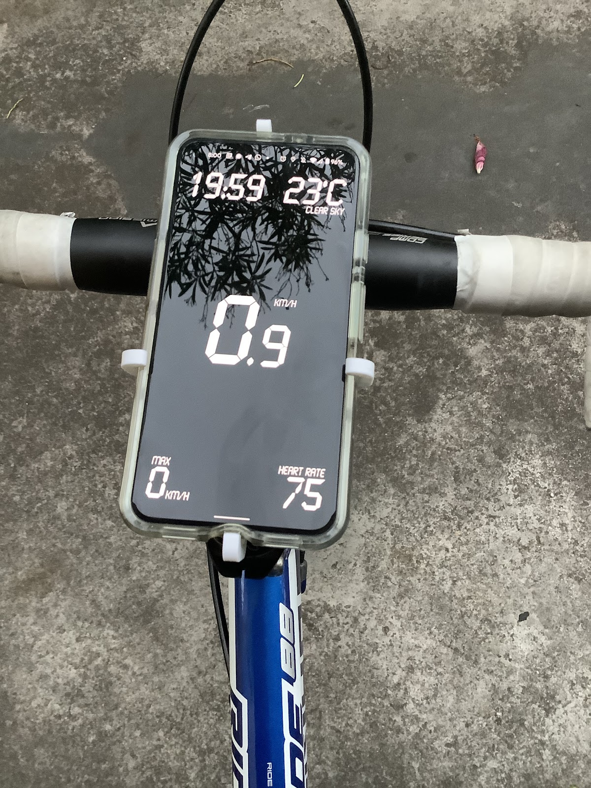
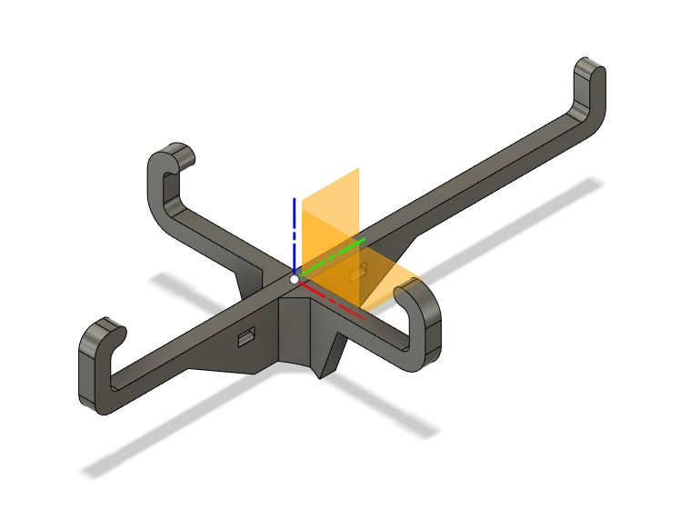
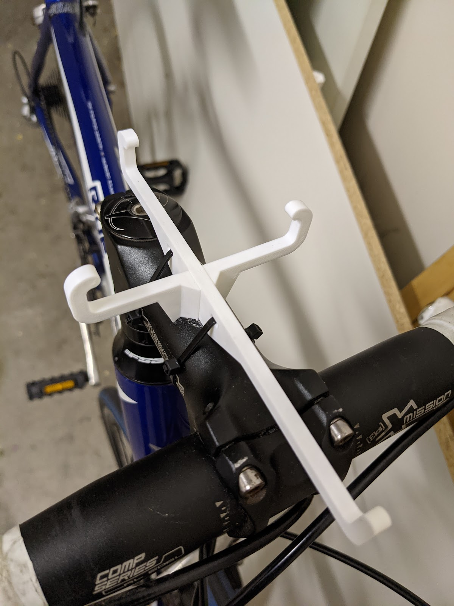

> #WeekendProject I wanted to try to add the heartrate reading from my MiBand to the simple web based bike UI I was working on. With the web bluetooth API it was super straightforward. ❤️ BLE [via twitter](https://twitter.com/thilinag/status/1363087498117742598)

> The mi band has discoverable setting and share heart rate over Bluetooth setting set to ON. More info on how to use web Bluetooth API here https://developer.chrome.com/articles/bluetooth/ [via twitter](https://twitter.com/thilinag/status/1363087502668488705)

> The bike UI is based on create react app and using geolocation.watchPosition to get speed. The mount is 3d printed. It's based on https://thingiverse.com/thing:614516. Had to remodel in Fusion360 since in original the horizontal arm can press my phone's side buttons. [via twitter](https://twitter.com/thilinag/status/1363087511740768263)

