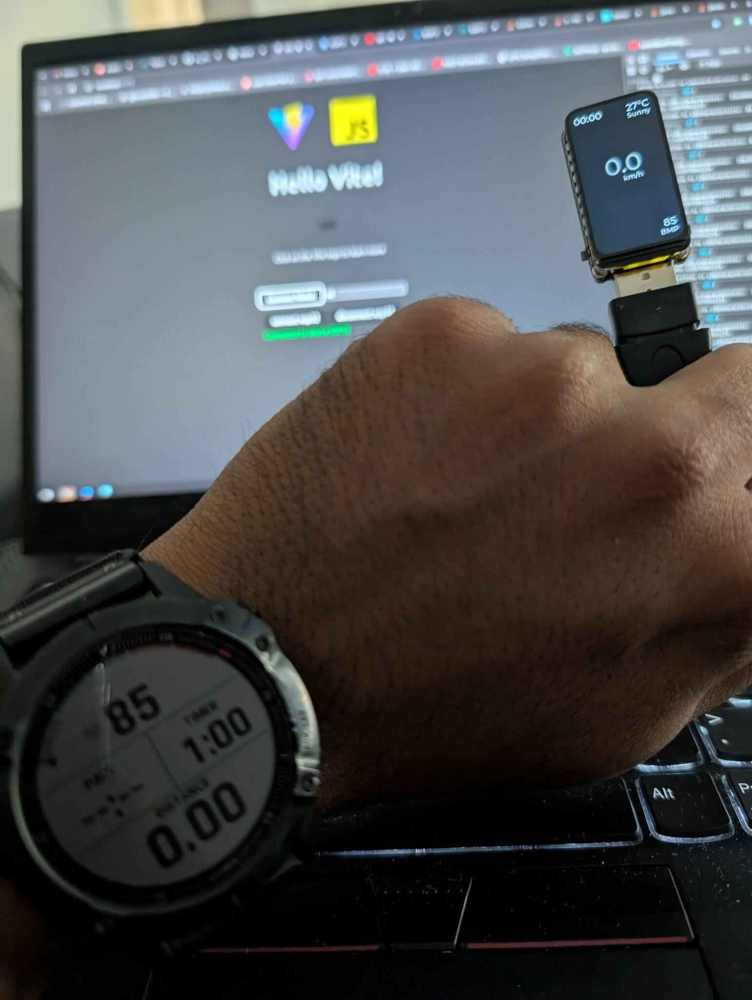
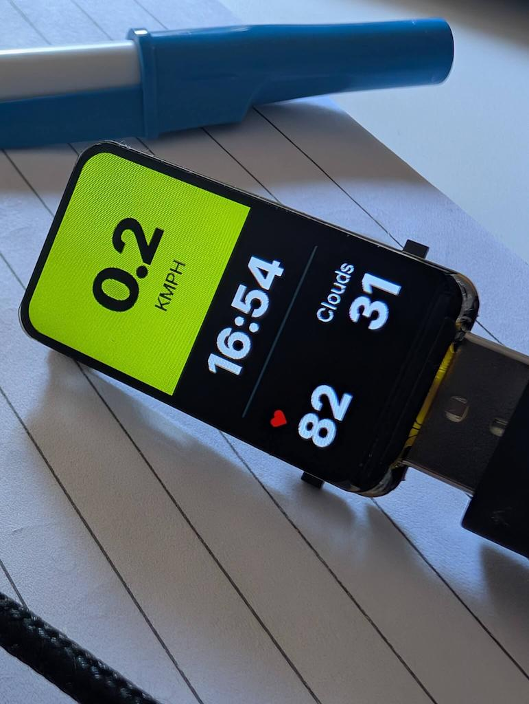

I've been tinkering with an ESP32 that comes with a built-in 1.47-inch display, and I thought—why not turn it into a bike computer? The idea is simple: use the ESP32 as a BLE device that pairs with my phone via Web BLE and also communicates with my Garmin watch. With a bit of work, I managed to display my current speed, heart rate, time, and live weather updates. Here’s what I did;

## The Setup

The UI is designed using SquareLine Studio, which generates LVGL code for the ESP32 display. This allows for nice interactive interface with minimal effort.

The ESP32 acts as a BLE peripheral, listening to data from the phone  which acts as a hub, relaying data to the ESP32 via Web BLE. The Garmin watch also connects to the same web page using BLE, sharing heart rate data.

- Speed: Pulled from the Geolocation Web API on my phone.
- Heart Rate: Fetched via BLE from my Garmin watch.
- Time: JavaScript time
- Weather: Retrieved from OpenWeatherMap API.

## The Good Stuff

Everything runs directly in the browser using Web BLE thanks to project fugu!. No bulky hardware, just a little ESP32 module on the bike powered by a small powerbank.

## The Challenges

There are a few challenges to tackle. One of the biggest drawbacks is the screen limitations—the built-in display is too small and not bright enough, making it difficult to read in sunlight. I'm considering switching to a different ESP32 form factor with an e-ink or brighter AMOLED display. Another issue is the Web Geolocation limitation; since the phone has to stay active, geolocation data stops updating if the browser tab is inactive.because of this power consumption is a concern, as keeping the phone active drains the battery.

This has been a fun little experiment, and while it's not a perfect solution yet, there’s definitely room for improvement—like finding a way to keep geolocation running in the background—but for now, it’s a cool, lightweight bike computer that does the job.

## TODO feature list

- Till web BLE is ready, make a native app to get geolocation data in the background, another option is to get a GPS module which can be attached to ESP32 directly.
- Make a 3d printed mount for the ESP32 device + the powerbank
- Get a better display, potentially a round one.
- Check out google navigation API for turn by turn navigation

