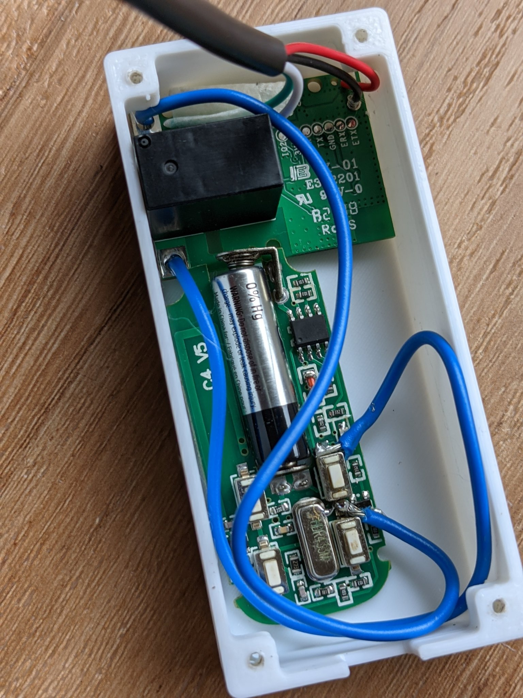
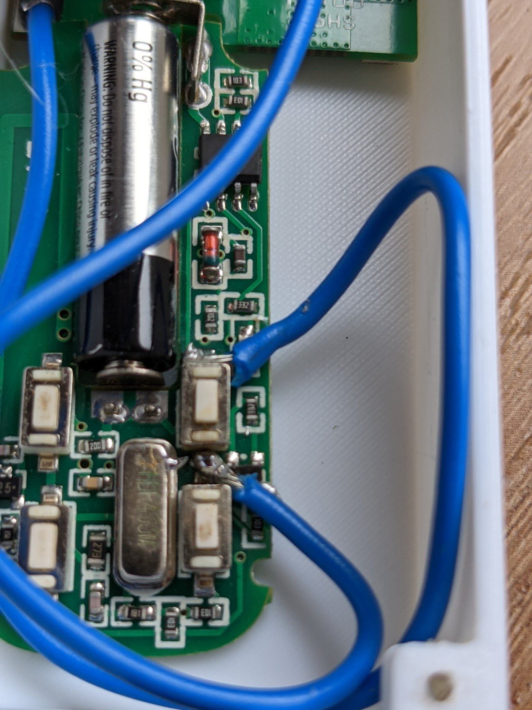
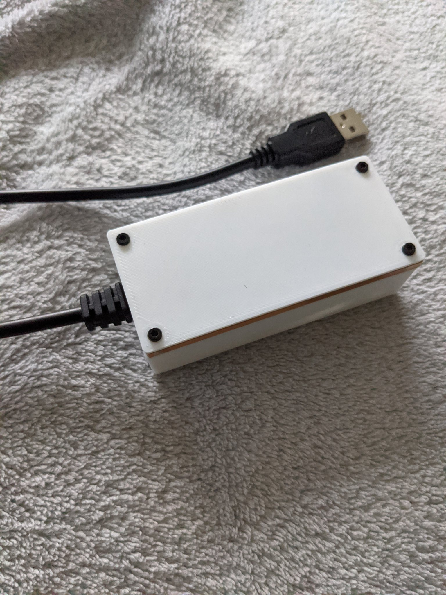

> Easy remote gate IOT. Remote switch is wired to SONOFF RE5V1C  5V wifi relay module with inching switched on. 3d printed a case to make things tidy. Can ask google to open the gate for me now.
[via twitter](https://twitter.com/thilinag/status/1414831105362907139)

