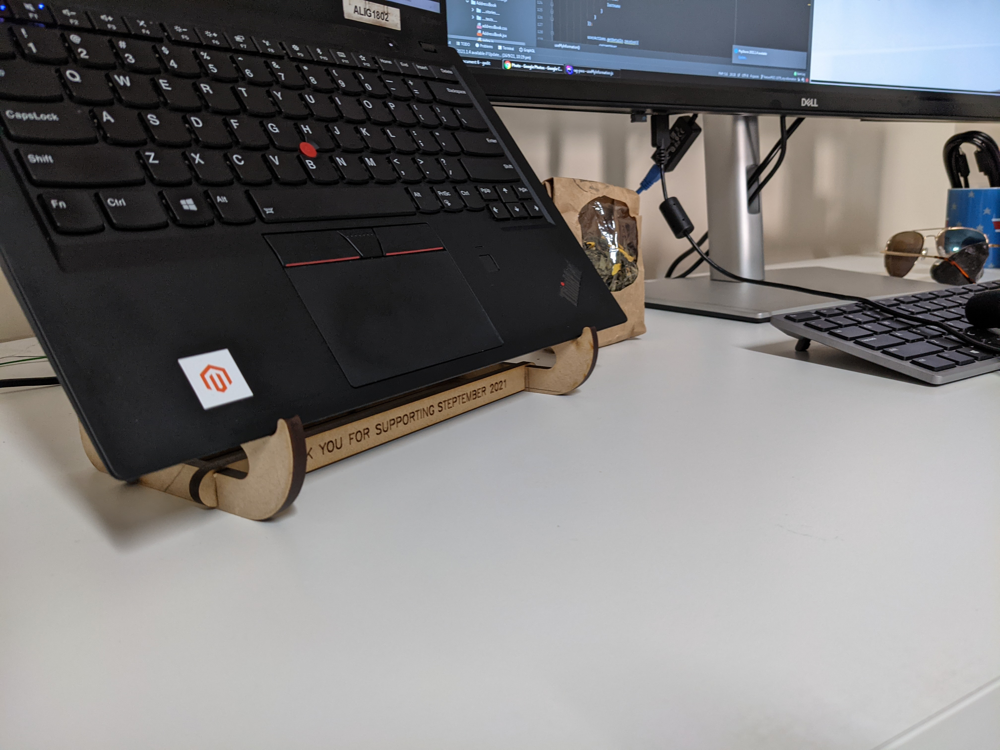

> Made simple laptop stands from scrap MDF at @MakerspaceAdl to raise funds for @SteptemberAU. Designed with @FreeCADNews and @inkscape. Files are at https://github.com/thilinag/laptopstand. Donate for the great cause here https://steptember.org.au
[via twitter](https://twitter.com/thilinag/status/1439773781732429831)

<model-viewer client:load id="reveal" loading="eager" orientation="180deg 0 0" tone="AgX" camera-controls touch-action="pan-y" auto-rotate src="/models/laptopstand.gltf" shadow-intensity="3" alt="A 3D model of the laptop stand"></model-viewer>

[Get the modal from onshape](https://cad.onshape.com/documents/bdbc690c6c6ea088c7deeb34/w/976162c33e866ff3c6914bea/e/bba8c6eec1ec53b59f8da03b?renderMode=0&uiState=679ece748076de63f29f3e2d)

