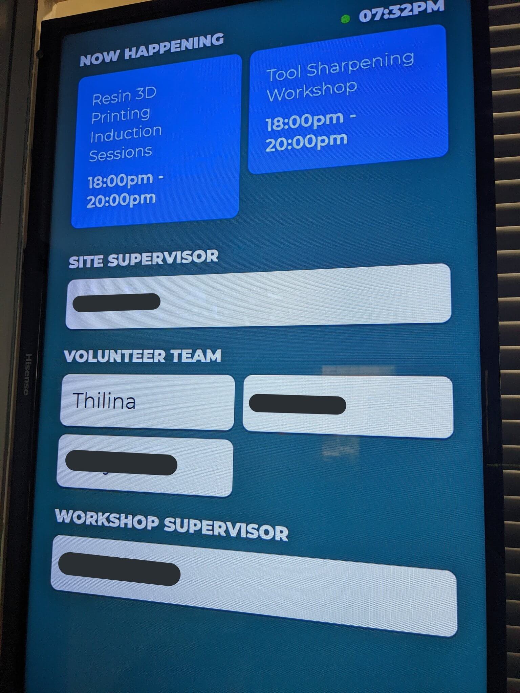

> Had fun making a socket io powered team board on a raspberry pi tv at local makerspace [via twitter](https://twitter.com/thilinag/status/1494241501261725698)

The tv shows volunteers who are in the space. The sign in system of the makerspace sends websocket requests when someone signs in which causes the screen to update.

It also shows upcoming and current events via humanitix API.

The raspberry Pi is powered directly from TV's USB port. It occasionally shows low voltage warning but running well so far.
