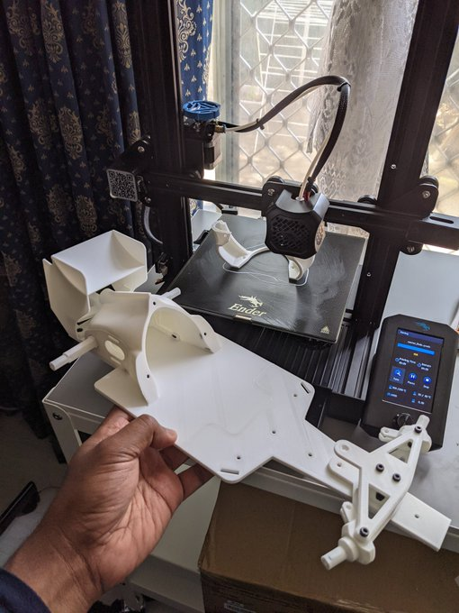
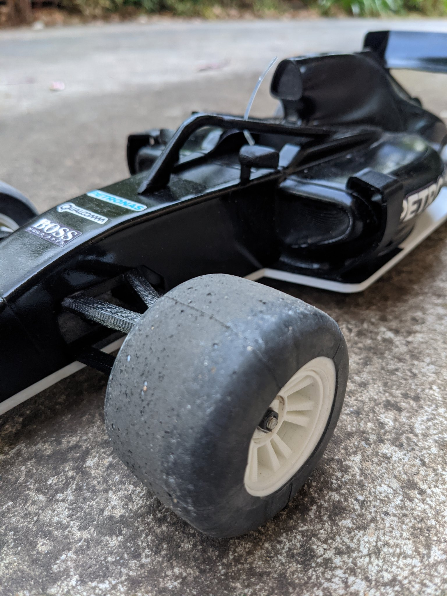
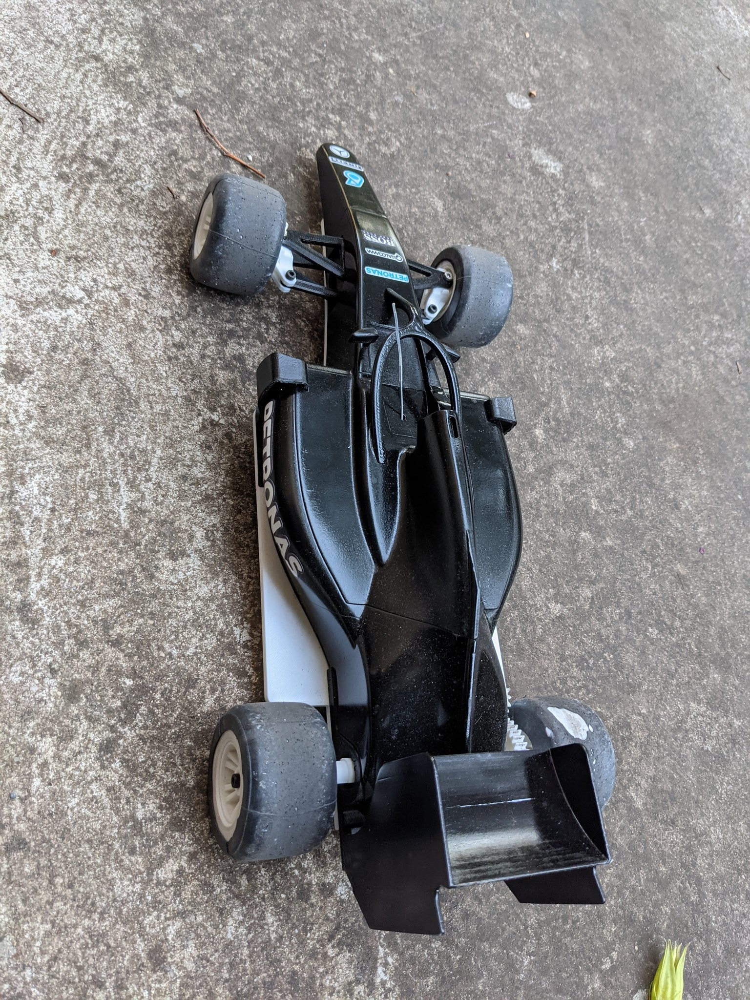
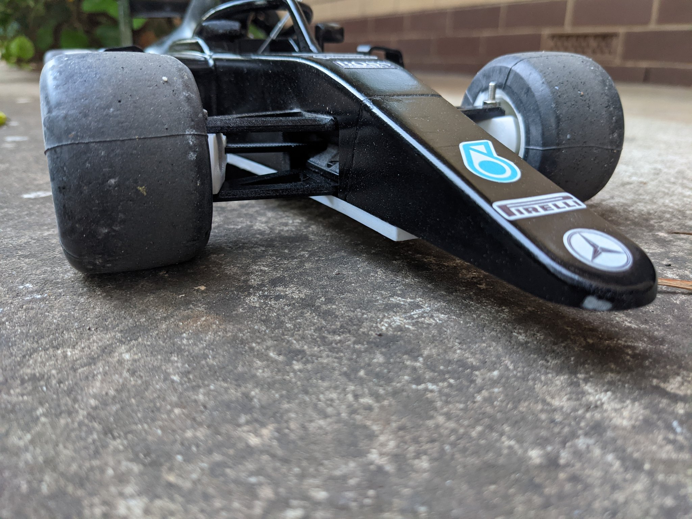

This is my journey of trying out [OpenRC F1 project](https://danielnoree.com/openrc-f1-build-guide/).

> Installed electronics and while waiting for proper rubber wheels, tried to make a tire with a piece of bicycle tube over PLA rim. Initially this seem to work well.
[via twitter](https://twitter.com/thilinag/status/1353214387541032960)

> But soon found out that it rips off after 30 mins of running on concrete floor 😅 also running without the front wing since I broke it twice already! [via twitter](https://twitter.com/thilinag/status/1359075388241051655)

