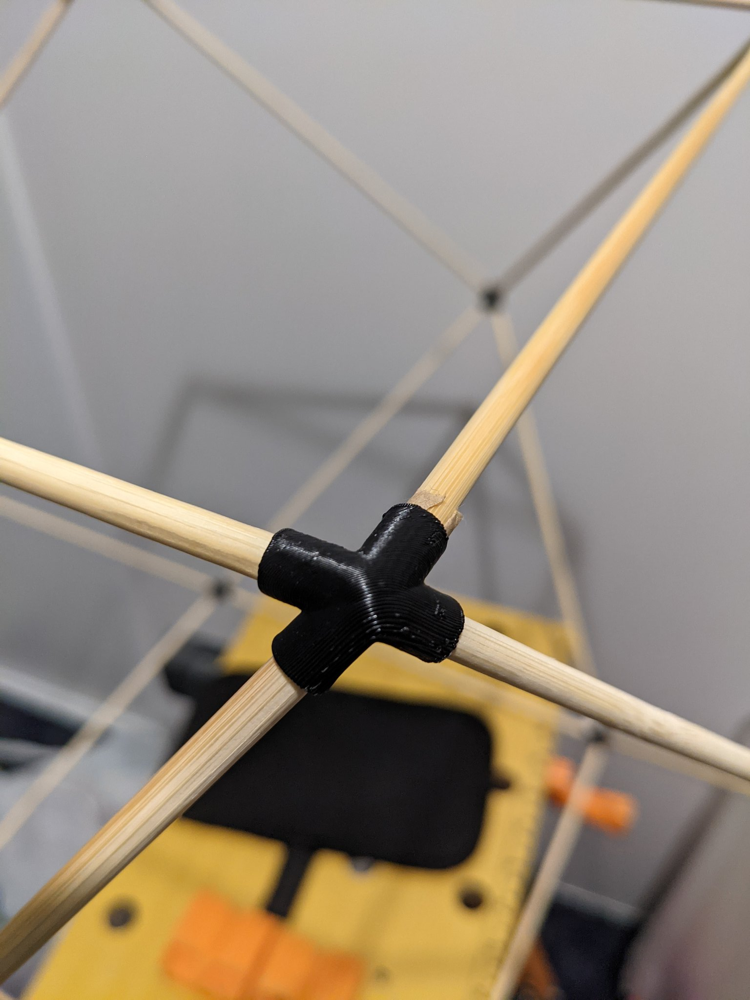
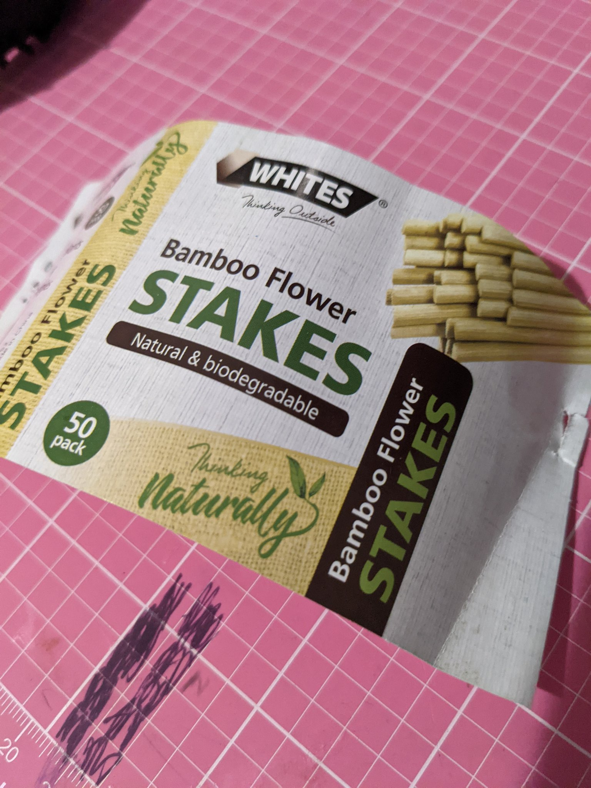
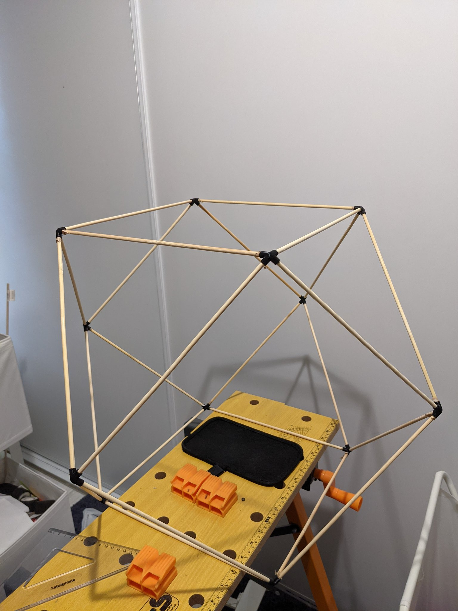

> Trying out 3d printed fitting to make vesak lanterns. Using bamboo flower stakes from Bunnings as the sticks [via twitter](https://twitter.com/thilinag/status/1386928330188869634)

Vesak lantern is a [Cuboctahedron](https://en.wikipedia.org/wiki/Cuboctahedron). It has 8 triangular faces and 6 square faces.

<model-viewer client:load id="reveal" loading="eager" tone="ACES" camera-controls touch-action="pan-y" auto-rotate src="/models/lanternjoint.gltf" shadow-intensity="3" alt="A 3D model of the laptop stand"></model-viewer>

[Get the modal from onshape](https://cad.onshape.com/documents/e71314a5e23d9ffd9a0e6810/w/278484667430c3fa7fd0d500/e/91ace6defc242ad01ec9f4b1?renderMode=0&uiState=644c81659929db0e600a7037)

[Get stl from thingiverse](https://www.thingiverse.com/thing:5996933)
